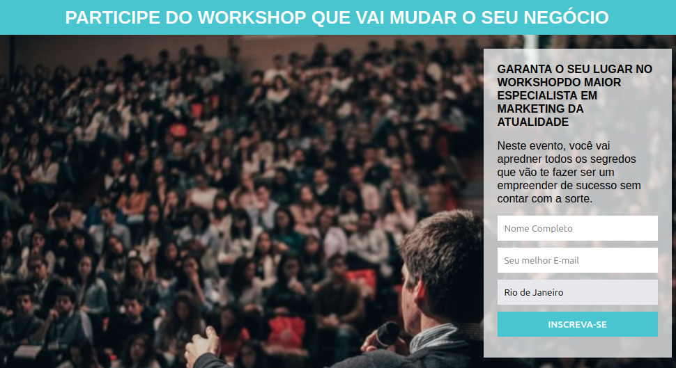

<h1 align="center"> Página Workshop 🚀💻</h1>

!
<h4 align="center"><a href="https://workshop-ebon.vercel.app">Confira o projeto aqui</a></h4>

## 🧠 Tecnologias utilizadas:

O site **ainda está em desenvolvimento**, pois estou em constante aprendizado. Mas até aqui utilizei as tecnologias:

    
    

## 📚 Alguns conceitos aplicados

Neste projeto apliquei os seguintes pontos:
+ Semântica HTML;
+ Responsividade;

---

<table>
  <tr>
    <td>
      
    </td>
    <td>
      Feito por <a href="https://github.com/DusKinDEV">Welber Gomes.</a> 🙋🏿‍♂️
    </td>
  </tr>
</table>

## 🏆 Licença

The [MIT License](./LICENSE).
